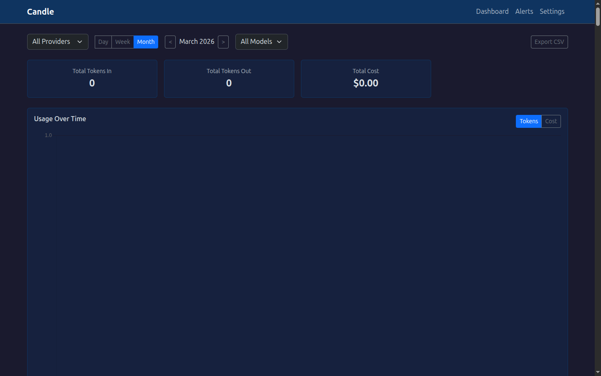
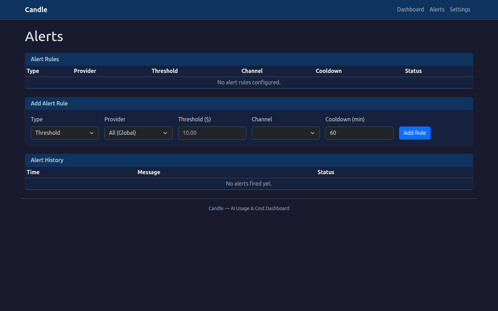

+++
title = 'Candle — Tracking AI Costs Before They Track You'
date = '2026-03-30T14:00:00-04:00'
draft = false
summary = 'An AI usage and cost dashboard that aggregates spending across providers. When you run models everywhere, you need a single pane of glass for the bill.'
categories = ['AI Engineering']
tags = ['ai-ops', 'fastapi', 'cost-management', 'ollama', 'claude', 'dashboard']
series = ['What I Build']
layout = 'post'
+++

When you run AI workloads across multiple providers — Claude API, Ollama Cloud, local Ollama instances, OpenAI — the costs scatter across different dashboards, different billing cycles, and different units of measurement. One charges per token, another per request, another per compute-minute. You don't notice you're overspending until the invoice arrives.

Candle is a dashboard that pulls usage data from every AI provider I use and presents it in one place. Total spend, per-provider breakdown, trend lines, and alerts when usage spikes beyond expected thresholds.

---

## The Problem It Solves

I run AI workloads across my homelab and cloud APIs:

- **Claude API** — Powers the deep evaluation agents in Hustle Eval, content generation in Vols News, and various development tools
- **Ollama Cloud** — Handles batch AI tasks where per-query cost matters more than peak capability
- **Local Ollama** — Runs on my AI workstation (RTX 5060) for latency-sensitive and private inference
- **Other providers** — Various API integrations that accumulate costs

Each provider has its own dashboard, its own usage format, and its own billing cycle. Candle normalizes all of it into a unified view.

---

## How It Works

Candle is a FastAPI application that polls provider APIs on a schedule, normalizes the usage data into a common schema, and serves it through a clean dashboard.

**Provider Adapters** — Each AI provider gets an adapter that knows how to authenticate, fetch usage data, and normalize it into Candle's internal format. Adding a new provider means writing one adapter — the rest of the pipeline doesn't change.

**Cost Normalization** — Different providers measure usage differently. Candle normalizes everything to a common unit: dollars per day, broken down by model and task type. This makes cross-provider comparisons meaningful.

**Alerting** — Configurable thresholds that trigger notifications when daily or weekly spend exceeds expected ranges. The kind of thing you want before your API bill surprises you, not after.

---

## The Stack

| Component | Technology |
|-----------|-----------|
| Backend | Python (FastAPI) |
| Frontend | Jinja2, Bootstrap 5 |
| Data | SQLite (SQLModel) |
| Scheduling | APScheduler |
| Deployment | Docker on LXC |

---

## What I Learned

**Observability for AI is an unsolved problem.** Traditional APM tools track request latency and error rates. AI workloads need token counts, cost-per-request, model utilization, and quality metrics. The tooling hasn't caught up yet, which means building your own is currently the only option.

**Provider abstraction pays compound interest.** The adapter pattern means I can switch providers or add new ones without touching the dashboard logic. When Ollama Cloud changed their API format, I updated one adapter. Everything else kept working.

**Cost awareness changes behavior.** Once I could see per-task cost breakdowns, I immediately found optimization opportunities. Hustle Watch was using Claude for tasks that Ollama Cloud handled equally well at a fraction of the cost. You can't optimize what you don't measure.

---

Candle is a small project by line count, but it fills a real gap. As AI becomes a routine part of infrastructure — not just an experiment — cost observability becomes as important as uptime monitoring. Knowing how much your AI workloads cost, in real time, across every provider, is table stakes for responsible engineering.

**Live:** [candle.rlmx.tech](https://candle.rlmx.tech)
