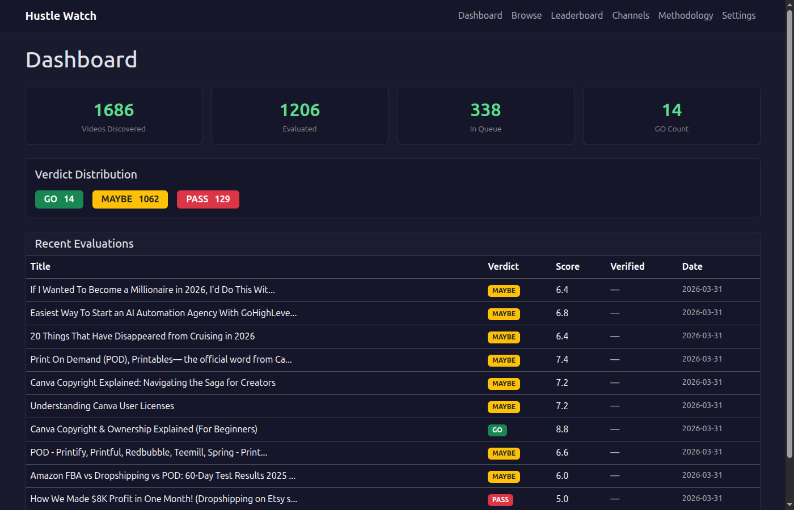
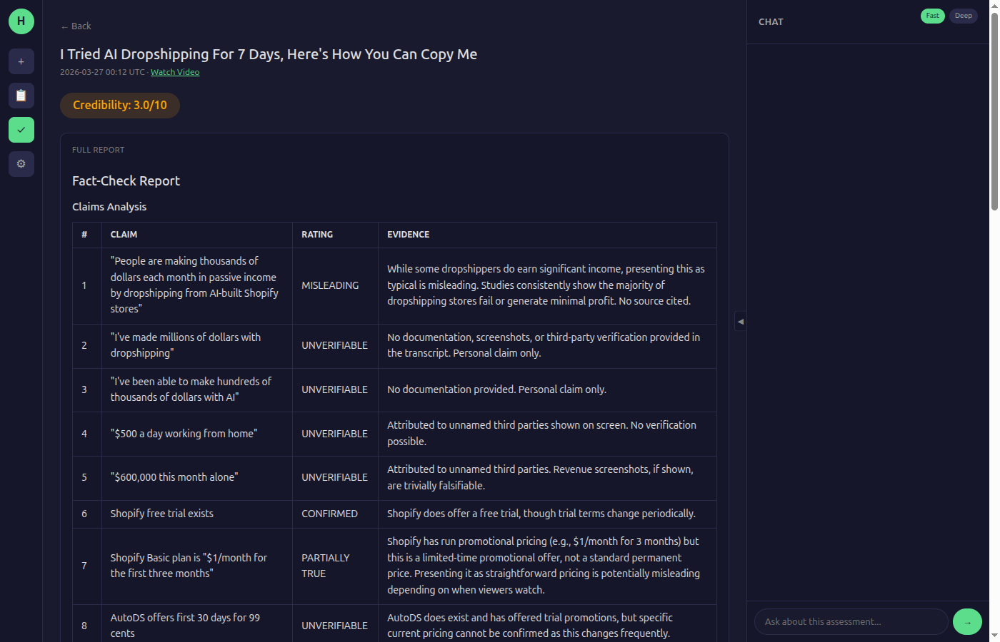
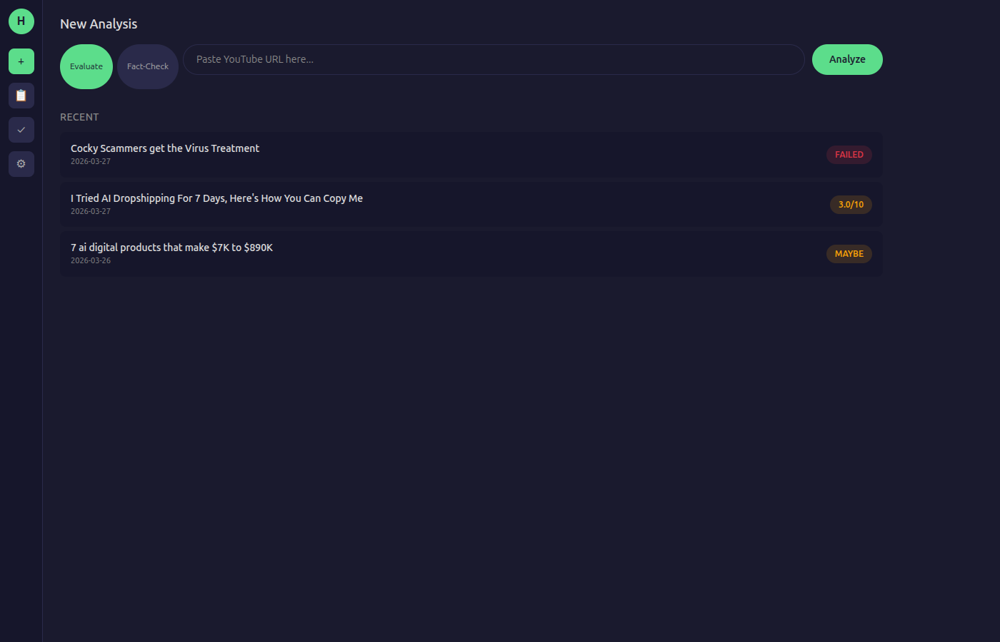

+++
title = 'Hustle Eval — AI Agents That Evaluate Business Ideas'
date = '2026-03-30T12:00:00-04:00'
draft = false
summary = 'A two-part system that crawls YouTube for business ideas, transcribes them with Whisper, and evaluates their viability using AI agents. Automated signal from noise.'
categories = ['AI Engineering']
tags = ['ai-agents', 'claude-api', 'ollama', 'whisper', 'fastapi', 'youtube', 'automation']
series = ['What I Build']
layout = 'post'
+++

YouTube is full of people pitching side hustles and business ideas. Some are legitimate. Most are recycled content wrapped in urgency. The problem isn't finding ideas — it's filtering them.

Hustle Eval is a two-part system that automates the entire evaluation pipeline: find the videos, transcribe them, and run each idea through a structured viability analysis. No hype, just data.

---

## The Two Halves

### Hustle Watch — The Crawler

Hustle Watch is the autonomous half. It runs on a schedule, crawling YouTube channels that consistently publish business idea content. When it finds a new video, it downloads the audio, transcribes it using Whisper, and runs the transcript through an evaluation model.

The evaluation isn't a simple thumbs-up/thumbs-down. Each idea gets scored across five dimensions: startup cost, solo feasibility, skill leverage, recurring revenue potential, and time to first dollar. The model produces a structured assessment with specific reasoning for each score, a no-BS summary, and a final verdict — GO, MAYBE, or PASS.

All of this happens without human intervention. I wake up to a database of evaluated ideas with scores and reasoning attached.

### Hustle Eval — The Deep Dive

When Hustle Watch flags something interesting, Hustle Eval does the deeper analysis. This is a web UI where I can paste any YouTube URL and get a full evaluation — the same five-dimension scoring, but augmented with a parallel research agent that validates claims against real market data.

The research agent checks for actual competitors, realistic revenue figures, and common failure modes. It's the difference between "this idea scores well on paper" and "here's what happens when people actually try this."

---

## The Agent Architecture

This is where it gets interesting from an engineering perspective. The system uses multiple AI agents with different specializations:

**Evaluator Agent** — Runs on Claude's API with tool use enabled. Analyzes the transcript, extracts the core business concept, and produces the structured viability assessment. Scoped to evaluation only — it can't browse the web or execute code.

**Research Agent** — Also Claude-based, but with web search and fetch tools. Takes the evaluated idea and independently validates it against market data. Finds real competitors, actual pricing, and reported results from people who've tried similar approaches.

**Hustle Watch Evaluator** — Runs on Ollama Cloud using Qwen for cost-effective batch processing. Handles the high-volume automated evaluations where per-query cost matters. Same scoring rubric, different model for the economics.

When both the evaluator and researcher run on the same idea, their outputs get synthesized into a unified report that highlights where they agree, where they disagree, and what the key decision points are.

---

## The Stack

| Component | Technology |
|-----------|-----------|
| Hustle Eval (web UI) | FastAPI, Jinja2, Bootstrap 5 |
| Hustle Watch (crawler) | FastAPI, APScheduler, yt-dlp |
| Transcription | Whisper (GPU-accelerated on RTX 5060) |
| Evaluation (deep) | Claude API (claude-sonnet) |
| Evaluation (batch) | Ollama Cloud (Qwen 3.5 397B) |
| Research | Claude API + web search tools |
| Database | SQLite (SQLModel) |

---

## Multi-Model Routing

One of the architectural decisions I'm happiest with is the multi-model routing. Not every task needs the most expensive model:

- **Batch evaluation** (Hustle Watch): Ollama Cloud — cost-effective at volume, good enough for initial screening
- **Deep evaluation** (Hustle Eval): Claude Sonnet — better reasoning for nuanced viability analysis
- **Research**: Claude Sonnet with tools — needs web access for market validation
- **Chat** (default): Ollama Cloud — handles conversational follow-ups cheaply, with a toggle to switch to Claude for deeper analysis

This means the system can process dozens of videos per day through Hustle Watch without burning through API credits, while reserving the more capable models for ideas that warrant deeper investigation.

---

## What I Learned

**Agent orchestration is a design problem, not a coding problem.** The hard part isn't making agents talk to each other — it's deciding what each agent should know, what tools it should have, and how to synthesize their outputs when they disagree. Tool scoping matters more than prompt engineering.

**Multi-model routing pays for itself immediately.** Running everything through Claude would cost 10-20x more with marginal quality improvement for batch tasks. Matching model capability to task complexity is the single biggest lever for AI system economics.

**Structured scoring beats vibes.** A five-dimension rubric with specific definitions produces dramatically more useful output than "is this a good idea?" The structure forces the model to reason about each dimension independently rather than anchoring on first impressions.

---

Hustle Eval is where infrastructure engineering meets AI system design. The crawling, transcription, and scheduling are pure infrastructure. The agent orchestration, model routing, and evaluation framework are AI engineering. The combination is more useful than either half alone.

**Live:** [hustle-eval.rlmx.tech](https://hustle-eval.rlmx.tech) | [hustle-watch.rlmx.tech](https://hustle-watch.rlmx.tech)
