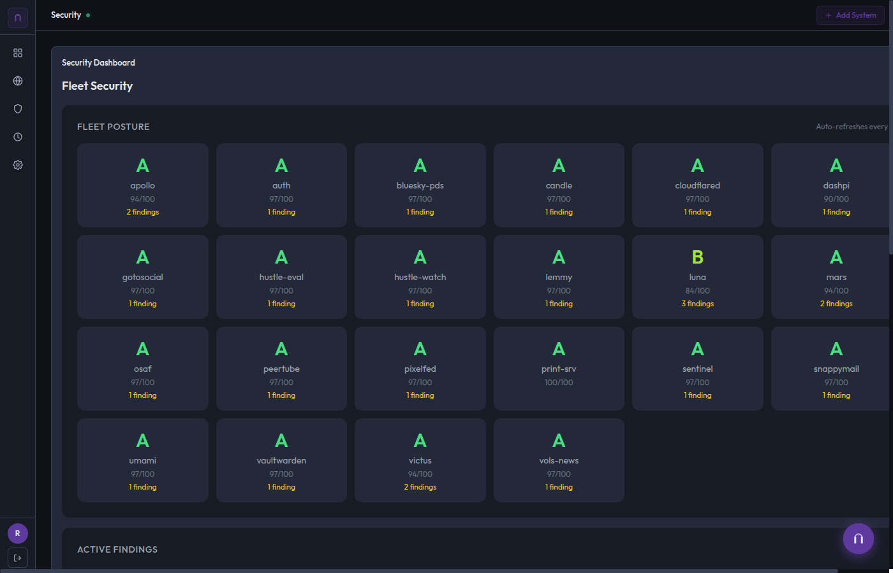

+++
title = 'Janus — A Control Plane for 26 Hosts'
date = '2026-03-30T10:00:00-04:00'
draft = false
summary = 'When managing 26 machines by hand stops working, you build a control plane. Janus is my answer to fleet management at homelab scale.'
categories = ['Infrastructure']
tags = ['homelab', 'fleet-management', 'fastapi', 'golang', 'websocket', 'infrastructure']
series = ['What I Build']
layout = 'post'
+++

There is a point in every homelab journey where SSH-ing into individual machines stops being charming and starts being a liability. For me, that point was somewhere around host number fifteen.

Janus is the control plane I built to manage my entire fleet — 26 hosts across bare metal, virtual machines, and LXC containers. It handles everything from firewall rules and DNS to backups and security posture scanning, all from a single dashboard.

---

## The Problem

My homelab runs on a mix of hardware: an OPNsense firewall, a Proxmox hypervisor, a dedicated media server, an AI workstation, a fleet of LXC containers, and a handful of VPS nodes scattered across providers. Each machine runs its own services, has its own configuration, and needs its own attention.

Managing this by hand meant maintaining mental models of 26 different systems, remembering which host runs what, and hoping I didn't fat-finger a firewall rule at 2 AM. The overhead was growing faster than the infrastructure.

---

## How It Works

Janus is a FastAPI application with a Jinja2 frontend that acts as the single point of control for the fleet.

The core design decision was the **dual-transport architecture**. Linux hosts run a lightweight Go agent that maintains a persistent WebSocket connection back to Janus. If the WebSocket drops — network blip, container restart, whatever — Janus falls back to SSH automatically. Non-Linux hosts (the OPNsense firewall, the Unraid NAS) are SSH-only from the start.

This means Janus always has a path to every machine. Real-time when possible, reliable when necessary.

### What Janus Manages

- **Firewall Rules** — nftables wrapper that generates, validates, and deploys rulesets across the fleet
- **DNS & DHCP** — Parses and manages dnsmasq configurations, handles zone records
- **Security Posture** — CrowdSec integration for threat intelligence, plus a scanner that audits SSH configs, open ports, and unattended upgrades across every host
- **Backups** — Nightly tar-and-rsync pipeline that stages to a local VM, then ships to the NAS with GFS rotation (7 daily, 4 weekly, 3 monthly)
- **Fleet Health** — Scheduled scans that surface disk usage, memory pressure, container status, and service health

### The AI Assistant

Janus also includes a built-in AI assistant powered by Ollama. It can answer questions about the fleet state and execute a small set of approved actions — restart a service, check disk usage, run a health scan. The action set is allowlisted and validated server-side. No amount of creative prompting will make it `rm -rf` anything.

Every morning, Janus runs an automated digest that summarizes overnight events, surfaces anything unusual, and flags hosts that need attention. The digest is grounded entirely in real fleet data — no hallucinated metrics.

---

## The Stack

| Component | Technology |
|-----------|-----------|
| Backend | Python (FastAPI, SQLModel, APScheduler) |
| Frontend | Jinja2 + Bootstrap 5 |
| Database | SQLite |
| Agents | Go (WebSocket client, system metrics) |
| Fallback | SSH (paramiko) |
| AI | Ollama (local inference) |

---

## What I Learned

**Dual-path transport is worth the complexity.** WebSockets give you real-time fleet visibility — agent heartbeats, live metrics, instant command dispatch. SSH gives you reliability when the WebSocket path is unavailable. Building both meant more upfront work, but the operational confidence is worth it.

**Guardrails on AI assistants are non-negotiable.** The assistant has an explicit action allowlist, input validation, length limits, and anti-jailbreak directives. It refuses anything outside its scope. This isn't paranoia — it's engineering discipline applied to a system that can touch production infrastructure.

**Automate the boring stuff first.** The backup pipeline and morning digest were the first features I built. They're also the ones that have saved me the most time. Glamorous features can wait; reliability can't.

---

Janus is the kind of project that doesn't exist as a product because nobody's homelab looks like anyone else's. That's precisely why building it was worthwhile — it solves *my* problem, exactly, with no compromises for generality. And every piece of it — the API design, the agent architecture, the security model — translates directly to production infrastructure work.

**Source:** [github.com/russmorefield](https://github.com/russmorefield)
**Live:** Internal only — [janus.home.rlmx.tech](https://janus.home.rlmx.tech)
