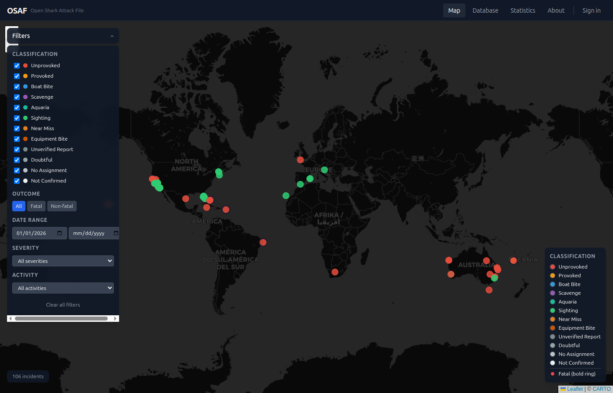
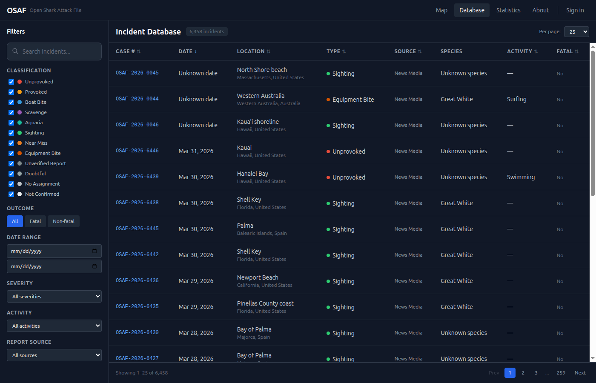

+++
title = 'OSAF — Building a Public Shark Attack Database'
date = '2026-03-30T11:00:00-04:00'
draft = false
summary = 'A full-stack geospatial application that collects, normalizes, and maps global shark incident data. Open data deserves open tools.'
categories = ['Full Stack']
tags = ['fastapi', 'react', 'postgresql', 'postgis', 'leaflet', 'geospatial', 'open-data']
series = ['What I Build']
layout = 'post'
+++

Shark attack data has been collected for decades, but accessing it has always been harder than it should be. The data exists in PDFs, spreadsheets, and behind paywalls. OSAF — the Open Shark Attack File — is my attempt to fix that.

It's a full-stack application that collects shark incident reports from multiple sources, normalizes them into a consistent schema, geocodes the locations, and serves it all through a searchable, map-based interface.

---

## Why This Exists

The existing shark attack databases are either locked behind academic access, poorly structured for programmatic use, or simply hard to navigate. If you wanted to answer a question like "how many unprovoked incidents occurred in Florida between 2015 and 2024," you were in for an afternoon of manual data wrangling.

OSAF makes that a query. Open data, open API, open source.

---

## The Architecture

The application is a three-container Docker stack:

**Collector** — A data pipeline that polls source feeds, extracts incident details from unstructured text, geocodes locations, and loads normalized records into the database. The extraction layer uses AI to parse free-text incident reports into structured fields (date, location, species, severity, activity). Every extracted field is validated against an allowlist — the AI can't invent data that doesn't exist in the source text.

**Backend** — A FastAPI REST API backed by PostgreSQL with the PostGIS extension for geospatial queries. Want every incident within 50 miles of a coordinate? That's a single spatial query. The API supports filtering by date range, species, severity, location, and activity type.

**Frontend** — A React application built with Vite and Tailwind CSS, using Leaflet for interactive mapping. Incidents render as clustered pins that expand as you zoom in. Click a pin, get the full incident report.

---

## The Data Pipeline

This is the part I'm most proud of. Raw shark incident data is messy — free-text descriptions, inconsistent date formats, vague location references ("near the pier" is not a coordinate), and occasional contradictions between sources.

The collector handles this with a multi-stage pipeline:

1. **Poll** — Fetch new records from configured sources
2. **Extract** — Parse unstructured text into structured fields using AI, with strict grounding rules (no fabrication, null for unknowns)
3. **Geocode** — Convert location descriptions to coordinates
4. **Deduplicate** — Match against existing records to avoid duplicates from overlapping sources
5. **Load** — Insert validated records with full audit trail

Every stage logs what it did and why. If the extractor can't confidently parse a field, it stores null rather than guessing.

---

## The Stack

| Component | Technology |
|-----------|-----------|
| Backend | Python (FastAPI, SQLModel, Alembic) |
| Database | PostgreSQL + PostGIS |
| Frontend | React, Vite, Tailwind CSS, Leaflet |
| Pipeline | Python (pollers, extractors, geocoders) |
| Deployment | Docker Compose (3 containers) |

---

## What I Learned

**PostGIS is extraordinary.** Spatial queries that would be painful to implement manually become one-liners. "Find all incidents within a bounding box" or "cluster by proximity" — PostGIS handles it with purpose-built indexes and operators.

**AI extraction needs hard guardrails.** When you point a language model at unstructured text and ask it to extract structured data, it will occasionally fabricate plausible-sounding details. The fix is an explicit field allowlist, mandatory null for low-confidence extractions, and input truncation to prevent prompt injection through source data.

**Open data is infrastructure.** Making data accessible isn't just a nice-to-have — it enables research, journalism, and public awareness. The API layer means anyone can build on top of this dataset without scraping HTML tables.

---

OSAF sits at the intersection of data engineering, full-stack development, and geospatial analysis. It's the kind of project that touches every layer of the stack — from raw data ingestion to interactive visualization — and demands that each layer be reliable.

**Live:** [osaf.net](https://osaf.net)
**Source:** [github.com/russmorefield](https://github.com/russmorefield)
