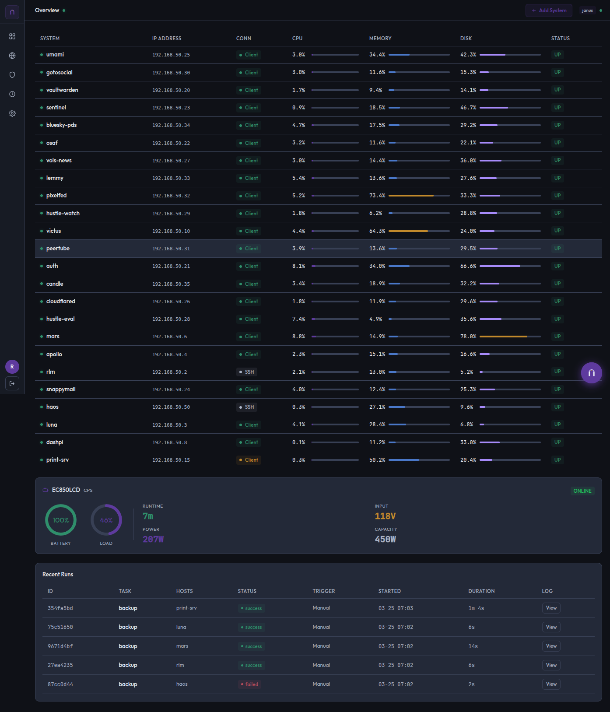
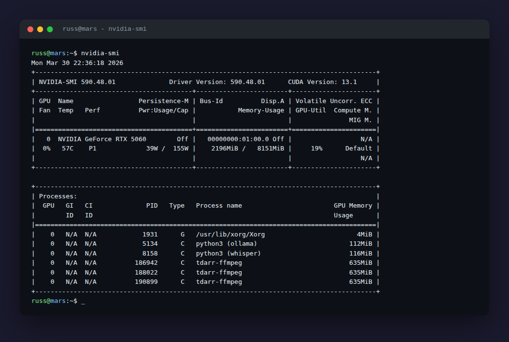

+++
title = 'The Homelab — 26 Hosts, Zero Cloud Bills'
date = '2026-03-30T15:00:00-04:00'
draft = false
summary = 'The infrastructure behind everything I build. Two hypervisors, 16 containers, 5 VPS nodes, and a philosophy of owning your own compute.'
categories = ['Infrastructure']
tags = ['homelab', 'proxmox', 'opnsense', 'docker', 'self-hosted', 'infrastructure', 'networking']
series = ['What I Build']
layout = 'post'
+++

Every project I've written about in this series runs on infrastructure I own. Not rented cloud instances with metered billing. Not serverless functions that abstract away the machine. Actual hardware, in my home, connected to my network, managed by tools I built.

This is the homelab. It's the foundation that makes everything else possible.

---

## The Fleet

The infrastructure spans 26 managed hosts across four tiers:

**Bare Metal** — The physical machines. An OPNsense firewall handling routing, DNS, and HAProxy reverse proxy. Two Proxmox hypervisors running VMs and containers. A dedicated media server. An AI workstation with an RTX 5060 for GPU inference and transcoding. An Unraid NAS for bulk storage and backups. A Raspberry Pi kiosk display. A print server.

**Virtual Machines** — A handful of VMs for workloads that need full OS isolation. The Janus control plane runs here, along with a set of development VMs spanning Ubuntu, Debian, Arch, and Rocky Linux for multi-distro testing.

**LXC Containers** — Sixteen lightweight containers on Proxmox, each running a single service. Password manager, SSO provider, analytics, monitoring, webmail, and every project I've deployed — OSAF, Vols News, Hustle Eval, Hustle Watch, Candle, and a full federated social stack (GoToSocial, PeerTube, Pixelfed, Lemmy, Bluesky PDS).

**VPS Nodes** — Five remote servers across two providers. Two run Storj storage nodes, two run Mysterium VPN nodes, and one serves as a WireGuard reverse proxy that routes external traffic back to the homelab without exposing my home IP.

---

## The Network

All internal traffic routes through OPNsense, which handles:

- **HAProxy** — Reverse proxy with TLS termination for every internal service. One HTTPS frontend, 50+ backends, all managed via the OPNsense API.
- **Unbound DNS** — Local DNS resolution with overrides that point `*.home.rlmx.tech` to the HAProxy frontend. Internal services get real hostnames, not IP:port combinations.
- **Cloudflare Tunnel** — External access for select services routes through a Cloudflare Tunnel running in a dedicated container. No inbound ports open on the firewall.
- **WireGuard** — The VPS reverse proxy maintains a WireGuard tunnel back to the homelab for services that need custom domains with proper SSL (Jellyfin, the project sites).

The result is that every service — internal or external — gets a clean HTTPS URL. No port numbers, no self-signed certificate warnings, no remembering which IP runs what.

---

## The AI Workstation

Mars is the GPU-equipped machine that handles compute-intensive workloads:

- **Ollama** — Local LLM inference for the Janus assistant and development work
- **Whisper/Subgen** — AI subtitle generation for the media library, using the RTX 5060 for CUDA-accelerated transcription
- **ComfyUI** — Image generation for content creation
- **Tdarr** — GPU-accelerated media transcoding using the dedicated NVENC encoder

The RTX 5060's 8GB VRAM means workload scheduling matters. Whisper and Ollama share CUDA cores, while Tdarr uses the dedicated NVENC engine. They coexist, but heavy concurrent usage requires awareness of what's running where.

---

## Backups and Security

**Backups** run nightly at 3 AM. Janus orchestrates a tar-and-rsync pipeline that pulls configs from every host, stages them locally, then ships to the NAS. GFS rotation keeps 7 daily, 4 weekly, and 3 monthly snapshots. If a container dies, I can rebuild it from the backup in minutes.

**Security** follows a defense-in-depth model:
- SSH key-only authentication everywhere, with ED25519 keys
- CrowdSec on every host for collaborative threat intelligence
- UFW with default-deny policies on all VPS nodes
- Authentik SSO for services that support OIDC
- Vaultwarden for credential management
- Unattended security upgrades on every Ubuntu/Debian host

The VPS nodes get additional hardening: SYN cookies, disabled ICMP redirects, reverse path filtering, and service dashboards locked to the home IP only.

---

## The Philosophy

There's a practical question behind every homelab: why not just use AWS?

For me, the answer is threefold.

**Sovereignty.** My data lives on my hardware. My services answer to my configuration. When a cloud provider changes their pricing, deprecates a service, or decides my content violates their terms, it doesn't affect me.

**Learning.** Every problem I solve in the homelab — networking, storage, security, automation — maps directly to the same problems at enterprise scale. The difference is that here, I own the entire stack. There's no abstraction hiding the complexity.

**Economics.** At 26 hosts and growing, the equivalent cloud bill would be substantial. The hardware paid for itself long ago. The electricity is a rounding error compared to what I'd spend on compute instances.

The homelab isn't a toy. It's a production environment that happens to be in my house. It runs 24/7, serves real users, and demands the same operational discipline as any professional infrastructure.

---

This is the infrastructure that powers everything in the "What I Build" series. Every project, every service, every experiment runs here. Building and maintaining it is the work I'm most proud of — not because any single piece is remarkable, but because the whole thing works. Reliably. Every day.

**Dashboard:** [dash.home.rlmx.tech](https://dash.home.rlmx.tech) (internal)
**Control Plane:** [janus.home.rlmx.tech](https://janus.home.rlmx.tech) (internal)
