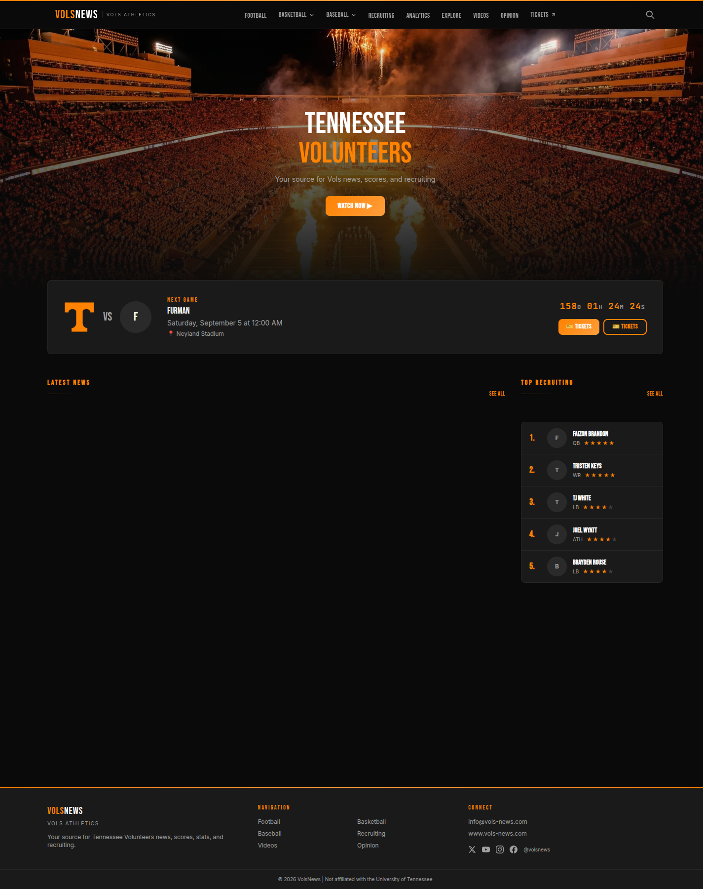
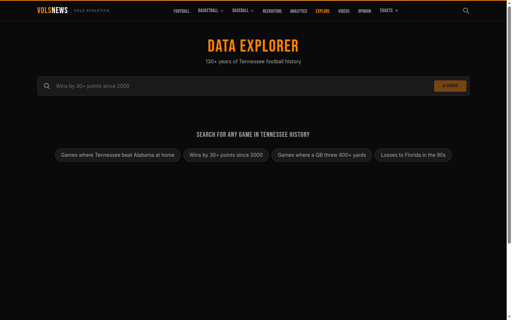

+++
title = 'Vols News — AI-Powered Sports Coverage'
date = '2026-03-30T13:00:00-04:00'
draft = false
summary = 'An automated sports journalism platform that generates Tennessee Volunteers coverage from live data. AI writes the first draft — editorial judgment shapes the final product.'
categories = ['AI Engineering']
tags = ['ai-content', 'fastapi', 'nextjs', 'postgresql', 'sports', 'automation']
series = ['What I Build']
layout = 'post'
+++

Sports journalism has a volume problem. Every game produces stats, every stat has a story, and there aren't enough writers to cover them all — especially for mid-tier college programs that don't get ESPN's full attention. Vols News is an experiment in using AI to close that gap for Tennessee Volunteers coverage.

The platform ingests live game data, generates draft articles with AI, and publishes them through a modern web frontend. The AI writes the first draft. Editorial judgment — what to emphasize, what to cut, what tone to strike — shapes the final product.

---

## How It Works

The system has three layers:

**Data Ingestion** — A backend pipeline that pulls game schedules, box scores, player stats, and standings from sports data APIs. This raw data gets normalized and stored in PostgreSQL, forming the factual foundation that the AI writes from.

**Content Generation** — When new data arrives (a game ends, stats update), the AI content pipeline generates draft coverage. The prompts are grounded entirely in the ingested data — the model can only reference stats that actually exist in the database. If data is missing for a particular area, the AI skips it rather than fabricating.

**Frontend** — A Next.js application that presents the generated content alongside team schedules, standings, and player statistics. Clean, fast, and built for the reading experience.

---

## The AI Content Pipeline

This is where the interesting engineering lives. Generating sports content that reads well and stays accurate requires more than just "summarize these stats."

The pipeline uses structured prompts that define the article type (game recap, season preview, player spotlight), inject the relevant data, and enforce strict grounding rules:

- **Input-only stats** — The model can only cite numbers from the provided data
- **Low-confidence fallback** — If the data doesn't support a confident narrative, the model produces a shorter, more conservative piece
- **Post-write verification** — Generated content is checked against the source data to flag any stat that doesn't match
- **Skip missing areas** — No gap-filling with general knowledge or speculation

The result is content that's factually reliable and tonally appropriate for sports coverage. It reads like a beat writer, not a chatbot.

---

## The Stack

| Component | Technology |
|-----------|-----------|
| Backend | Python (FastAPI) |
| Frontend | Next.js, React |
| Database | PostgreSQL |
| Cache | Redis |
| AI | Claude API (grounded generation) |
| Deployment | Docker Compose on LXC |

---

## The Explore Feature

One feature I'm particularly happy with is the natural language search. Users can ask questions like "how did the basketball team do in January?" and the system translates that into structured database queries — filtering by sport, date range, and content type.

The query translation uses AI, but with allowlisted filter values and strict null handling. If someone asks about a sport we don't cover, the response says so explicitly rather than improvising. Off-topic queries return empty results, not hallucinated articles.

---

## What I Learned

**Grounding is everything in AI content.** The difference between useful AI-generated content and hallucinated garbage is entirely in how tightly you constrain the model's inputs. When the model can only reference data you've verified, the output quality tracks the data quality. Garbage in, garbage out still applies — it just applies to the prompt, not the training data.

**Sports data is messier than you'd expect.** Inconsistent team names, varying stat formats between sports, games that get rescheduled or cancelled, doubleheaders — the normalization layer handles more edge cases than the AI layer. Data engineering is the unsexy foundation that makes the AI layer possible.

**AI-assisted doesn't mean AI-only.** The best output comes from AI generating the first draft and human judgment shaping the final product. The AI handles the volume — turning raw stats into readable prose at scale. The human handles the editorial — deciding what matters, what's interesting, and what the audience actually wants to read.

---

Vols News sits at the intersection of data engineering, AI content generation, and frontend development. It's a small-scale demonstration of a pattern that scales: ingest structured data, generate grounded content, serve it through a modern interface. The same architecture works for financial reporting, product updates, or any domain where structured data can become readable narrative.

**Live:** [vols-news.com](https://vols-news.com)
